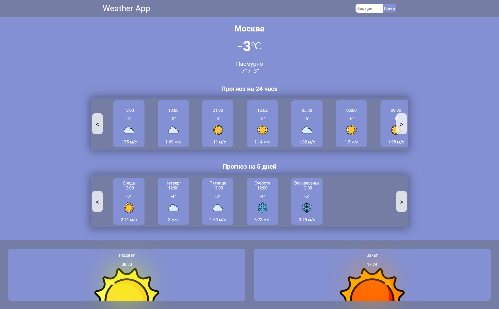

# Weather App



This is a weather forecast application that retrieves weather data using the [OpenWeatherAPI](https://openweathermap.org/api) and displays the forecast. The app is built with **React** for the frontend and **FastAPI** for the backend. **Redis** is used for caching weather data to reduce the number of API calls to OpenWeatherAPI. Both the frontend and backend are containerized using **Docker**.

## Features

- Retrieve current weather information.
- Display a 5-day weather forecast.
- Search for weather by city name.
- Caching of weather data using Redis to minimize redundant API requests.
- User-friendly UI built with React.
- Fast and efficient backend built with FastAPI.
- Fully containerized with Docker.

## Technologies Used

- **Frontend**: React
- **Backend**: FastAPI
- **Weather API**: OpenWeatherAPI
- **Cache**: Redis
- **Containerization**: Docker
- **Styling**: CSS

## Prerequisites

- [Docker](https://www.docker.com/get-started) installed on your machine.

## Installation

### 1. Clone the repository:

```bash
git clone https://github.com/yourusername/weather-app.git
cd weather-app
```

### 2. Configure ENV file :

1. Create an account on [OpenWeatherAPI](https://openweathermap.org/api) and get your API key.
2. Add the API key to the `.env` file under the root directory.
3. Do the same for [Yandex GeocoderAPI](https://yandex.ru/maps-api/products/geocoder-api).
3. Add Reddis password to the `.env` file.

How .env looks according to our docker-compose.yml:

```env
WEATHER_API_KEY=YOUR_OPEN_WEATHER_API_KEY
VITE_GEOCODE_API_KEY=YOUR_GEOCODE_API_KEY
REDIS_PASSWORD=YOUR_REDIS_PASSWORD
BACKEND_PORTS="8000:8000"
FRONTEND_PORTS="5173:5173"
REDIS_PORTS="6379:6379"
BACKEND_PATH=/app/backend
FRONTEND_PATH=/app/frontend
```

### 3. Build and run the Docker containers:

To start the frontend, backend, and Redis services in Docker containers, run the following command:

```bash
docker compose up --build
```

This will:
- Build the frontend and backend Docker images.
- Start the frontend on `http://localhost:5173`.
- Start the backend on `http://localhost:8000`.
- Start Redis service for caching.


### 4. Access the app:

Once the containers are up and running, open your browser and navigate to `http://localhost:5173` to use the weather app.
 

## Stopping the Application

To stop the Docker containers:

```bash
docker compose down
```

This will stop and remove the containers but leave the images intact.

## License

This project is licensed under the MIT License - see the [LICENSE](LICENSE) file for details.
